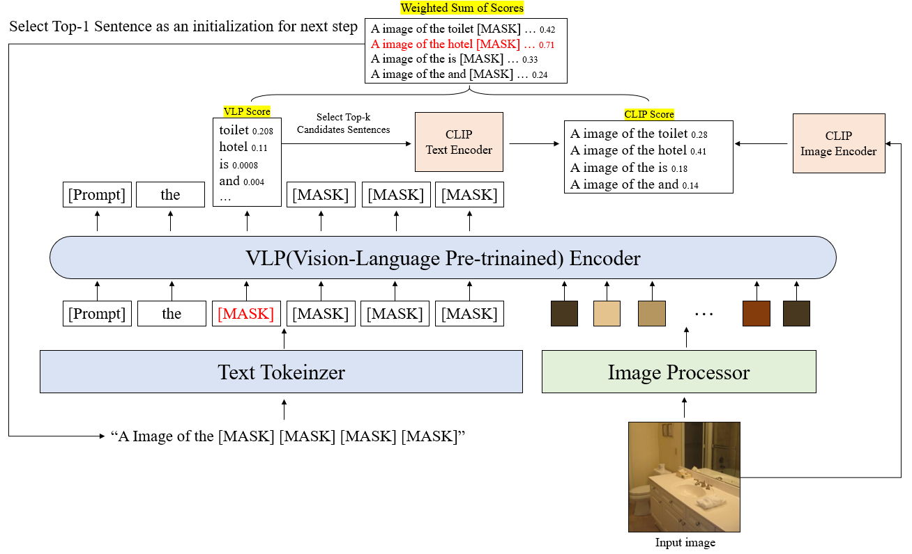

# IConZIC : Image-Conditioned Zero-shot Image Captioning by Vision-Language Pre-Trained Model
**[Korea University COSE461 Final Project] **

 
Seonghu Jeon, Jiwon Jeong, Byungwoo Jeon. Seongmin Ko
 

***

### Framework

### Results

### Acknowledgment 
This code is based on the [bert-gen](https://github.com/nyu-dl/bert-gen), [MAGIC](https://github.com/yxuansu/MAGIC) and [ConZIC](https://github.com/joeyz0z/ConZIC)
